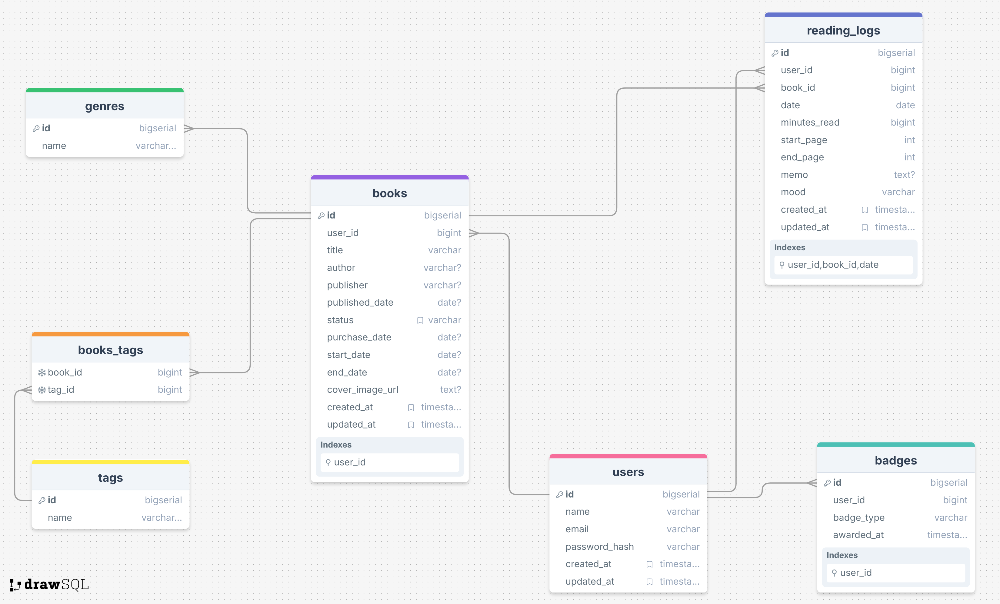

# TSUNDOKU Manager

## 概要

積読（買ったまま読めていない本）が増えてしまう悩みを解消するための、
**「読む or 手放す」意思決定を支援するWebアプリ**です。

単なる読書管理ではなく、
「完璧に読まなければならない」という心理的ハードルを下げ、
本と向き合う行動そのものを後押しすることを目的としています。

---

## 制作背景

私自身、本を買うこと自体は好きな一方で、

- 最初から完璧に読もうとしてしまう
- 読み切れない罪悪感から本を開かなくなる
- 結果として積読が増え続ける

という状態に長く悩んでいました。

そこで  
**「読むかどうか」ではなく「この本とどう付き合うか」を整理できる仕組み**  
があれば、積読は減らせるのではないかと考え、本アプリを開発しました。

---

## 想定ユーザー

- 積読が増えて自己嫌悪を感じている人
- 完璧主義で本を途中で投げ出すことに抵抗がある人
- 読まない本を手放したいが判断できずにいる人

---

## 主な機能

- ユーザー登録 / ログイン機能
- 本の登録（タイトル・著者・メモなど）
- 本の一覧表示
- 本の詳細表示
- 本の編集・削除
- 読書ステータス管理（例：未読 / 読書中 / 読了 / 手放す）

---

## 使用技術

### Backend

- PHP
- Laravel

### Frontend

- Blade
- Tailwind CSS

### Database

- PostgreSQL

### Infrastructure / その他

- Docker（Laravel Sail）
- GitHub
- Vite

---

## 画面構成

- ログイン / 新規登録画面
- 本の一覧画面
- 本の詳細画面
- 本の登録・編集画面

---

## ER図

（ここに ER図の画像、またはリンクを配置予定）


---

## 工夫したポイント

- 「管理」ではなく「意思決定」に焦点を当てた設計
- 自分自身が日常的に使うことを前提に、操作数を最小限にしたUI
- 削除操作時には確認アラートを表示し、誤操作を防止

---

## 今後の改善予定

- 読書履歴の可視化（グラフ表示など）
- 本を手放す判断をサポートする質問フローの追加
- ユーザーの利用状況に応じたリマインド機能

---

## セットアップ方法

```bash
git clone https://github.com/s-shigemat217/TSUNDOKU-Manager.git
cd TSUNDOKU-Manager
cp .env.example .env
./vendor/bin/sail up -d
./vendor/bin/sail artisan migrate
./vendor/bin/sail artisan storage:link
```
